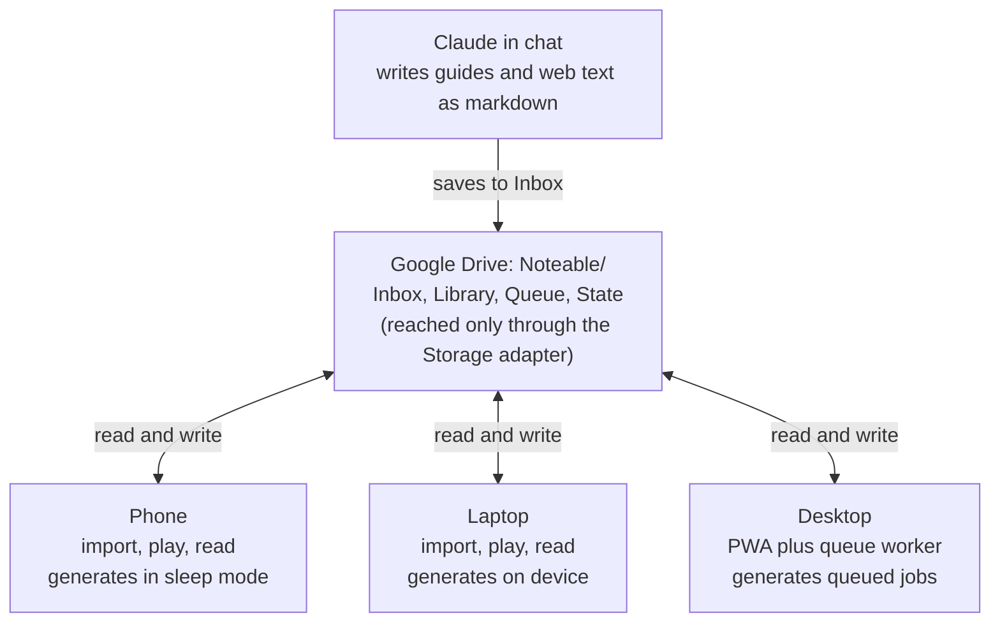

# Noteable — Project 109 Spec

Oct 6, 2026 · Rob

## Overview

Noteable turns documents into listenable audiobooks and study guides, for Rob's personal use on his S23 Ultra, iPhone, laptop and desktop. It is built for listening on the commute and for reviewing the same material as text.

It has two modes:

- **Narrate:** reads the source material as-is, cleaned up for listening.
- **Teach:** narrates a study guide written in chat with Claude from the source documents, with an overview, key concepts, terms, examples, review questions and a recap.

Everything lives in one Noteable folder in Rob's Google Drive, which Claude can also read and write. School and non-school material share the same library.

## Locked decisions

Every decision below was made in the planning chat on Oct 5–6, 2026.

| Area | Decision |
| --- | --- |
| Product | Standalone app, separate from Term Binder |
| Form factor | Installable PWA, one codebase for all devices |
| Hosting | GitHub Pages (static); Railway kept as a future upgrade path |
| Voice engine | Kokoro-82M only, running locally; no paid voices for now |
| Voices | Bella, Nicole, River, Sky (US F) · Emma, Lily (UK F) · Adam, Eric, Michael (US M) · Fable (UK M) |
| Generation | Hybrid: on the initiating device, with in-app sleep mode; desktop queue as backup |
| Sign-in | Google account |
| Storage and sync | Library, sources, audio, queue and playback state in one Drive folder, behind a swappable storage adapter |
| What syncs | Everything |
| Offline audio | Downloaded to a device only when tapped |
| Audio format | MP3, 64 kbps mono |
| Import formats | PDF, DOCX, PPTX, EPUB, Drive files, Zotero, plus text/markdown dropped in the Inbox |
| Web and YouTube | Collected in chat with Claude and saved to the Inbox; no fetcher in the app |
| Cleanup | Skip page numbers, headers, footers, inline citations and the reference list; read footnotes at the end of each section |
| Items | Single-document audiobooks and multi-source course packs |
| OCR | Done by the device that starts the job |
| Teach mode | Guides written by Claude in chat and saved to Drive; length set by how much there is to teach |
| Outputs | Audio plus a readable version in the app |
| Library | One app folder; collections for courses or anything else, plus Inbox |
| Player | Speed 0.75–2×, ±15 s skip, chapter jump, lock-screen and earbud controls, bookmarks with notes, synced resume (sleep timer dropped by Rob, Oct 8) |
| Review questions | Fixed pause before each answer |

## Architecture

Noteable is a static PWA with no server of its own. GitHub Pages serves the app, and Google Drive holds all data.



Claude and every device meet at the Drive folder. Each device can import, play and generate, and the desktop also runs the queue worker for jobs sent from other devices.

## Drive layout and storage adapter

All data lives under one `Noteable/` folder in Rob's Drive. Each item is a folder, so it can be moved between collections by dragging it in Drive.

```
Noteable/
  Inbox/                     drop zone: Claude and Rob save files here
  Library/
    <Collection>/            e.g. ECON 1000, POLS 1000, General
      <Item>/
        item.json            title, type, voice, chapters, status
        sources/             original PDFs, DOCX, PPTX, EPUB, md
        text/                cleaned narration text, one file per chapter
        guide.md             teach-mode guide (when present)
        audio/               01.mp3, 02.mp3 … one per chapter
  Queue/
    <job-id>.json            pending jobs for the desktop worker
  State/
    playback.json            resume positions per item and chapter
    bookmarks.json           bookmarks with notes
    settings.json            default voice
```

The app never calls Drive directly. It calls a `Storage` adapter with these operations:

- `list(path)`, `read(path)`, `write(path, data)`, `move(from, to)`, `delete(path)`
- `watch(path)` (polling on Drive)
- `enqueue(job)`, `claim(jobId)`, `complete(jobId)`

V1 ships `DriveStorage`. A later `RailwayStorage` implements the same interface, so moving to Railway touches only the adapter.

## Import and text processing

Import runs in the browser on whichever device starts it, with no server.

| Source | How it gets in | Reader |
| --- | --- | --- |
| PDF | Upload, or pick from Drive | PDF.js text layer |
| Scanned PDF | Same; detected by an empty text layer | OCR on the initiating device (Tesseract.js) |
| DOCX | Upload or Drive | mammoth.js |
| PPTX | Upload or Drive | JSZip, slide text and speaker notes in slide order |
| EPUB | Upload or Drive | JSZip, chapters from the spine |
| Google Docs | Drive picker | Drive export as text |
| Zotero | Zotero web API with Rob's API key | Item metadata plus its attached PDF |
| Web, YouTube, notes | Claude saves `.md` to `Inbox/` from chat | Markdown parser |

**Cleanup rules for narration:**

1. Drop page numbers and repeated running headers and footers. A line that repeats on most pages counts as a header or footer.
2. Drop inline citations such as (Smith, 2019) and \[12\].
3. Drop the reference list or bibliography.
4. Collect footnotes and read them at the end of their section, introduced as "Notes for this section."
5. Rejoin hyphenated line breaks and merge broken lines into paragraphs.
6. Split chapters at headings. Use the EPUB spine, PPTX slide groups or PDF outline when present.

Before generating audio, the cleaned text shows as a preview, and Rob can edit or exclude chapters.

**Course packs** combine several sources into one item, in an order Rob sets. Each source becomes one or more chapters.

## Guide file format

Teach-mode guides are markdown files with a short YAML header. Claude writes them in chat and saves them to `Inbox/` or straight into an item folder. Each `##` heading becomes a chapter in both the audio and the reading view.

```markdown
---
title: ECON 1000 Week 3 — Opportunity Cost
collection: ECON 1000
mode: teach
voice: am_michael
sources: [Week 3 slides.pdf, Mankiw ch. 1]
---

## Overview
Plain-language framing of what this guide covers.

## Key concepts
Each concept explained in a few short paragraphs.

## Key terms
- **Opportunity cost:** the value of the next best alternative given up.

## Examples

## Review questions
**Q:** If your hourly wage rises, does the cost of a night off go up or down?
[pause 5s]
**A:** It goes up, because each hour off now means giving up more income.

## Recap
```

**Markers the narrator understands:**

- `[pause Ns]` inserts N seconds of silence. The default before review answers is 5 s.
- `**Q:**` and `**A:**` are read as "Question" and "Answer".
- Bold and italics are read normally; the reading view keeps the formatting.
- `voice` in the header overrides the default voice for that item.

Narrate-mode items use the same format, written by the importer instead of Claude, with `mode: narrate`.

## Generation: sleep mode and desktop queue

When Rob taps Generate, he chooses **This device** or **Send to desktop**. Both produce the same files in Drive.

**On this device**

- Kokoro runs in the browser with kokoro-js: WebGPU at fp32 when available, otherwise WASM at q8.
- Text is generated in sentence groups of about 300 characters, then each chapter is encoded to 64 kbps mono MP3 and uploaded to `audio/`.
- Progress is saved after every chapter, so an interrupted job resumes from the last finished chapter.
- Before starting, the app shows an estimate based on this device's measured speed.

**Sleep mode**

- One tap after starting a job. It holds a screen Wake Lock so the tab stays in the foreground and is not throttled.
- The screen goes fully black. A dim progress line drifts slowly to avoid burn-in. On AMOLED, black pixels are off.
- Touch is locked until a long press of about 1.5 s.
- When the job finishes, the phone vibrates and plays a soft chime, and the screen wakes.
- The page warns that pressing the power button or switching apps pauses the job, and recommends charging for long jobs.

**Desktop queue (backup)**

- Send to desktop writes a job file to `Queue/` with the item, chapters, voice and status `pending`.
- A small Node worker on the desktop polls `Queue/` every 60 s through the Drive API. It claims a job by setting status `working`, generates with Kokoro on the desktop, uploads the MP3s and sets status `done`.
- The app shows queue status. A job in `working` with no update for 15 minutes returns to `pending`.
- The worker starts with Windows and runs from the system tray.

## Player and reading view

The player is built for hands-free listening on transit, and the reading view shows the same guide as text.

**Player**

- Playback speed from 0.75× to 2× in 0.25 steps, remembered per item. New items start at 1×.
- Skip back and forward 15 s, and jump to the previous or next chapter.
- Lock-screen and earbud controls through the Media Session API, showing the title, chapter and collection.
- Bookmarks at the current time, each with an optional note.
- Resume position saved every 10 s and on pause, and synced through Drive.
- Review-question pauses are baked into the audio as silence.

**Reading view**

- Shows the guide or cleaned text with its formatting, split into the same chapters as the audio.
- Tapping a paragraph starts audio from that chapter.
- Bookmarks and their notes appear in the margin.

**Library**

- Collections list, with items showing their mode, length, progress and whether they are downloaded on this device.
- Download and remove-download buttons per item.
- The Inbox shows new files, with an Import action for each.

## Sync and offline

Drive is the single source of truth, and every device reads and writes the same files.

- **Sign-in:** Google Identity Services with the full `drive` scope, so the app can see files Claude saves to the Inbox. The narrower `drive.file` scope only covers files the app created itself. The Google Cloud project stays in testing mode with Rob as its only test user, so it needs no Google verification. Tokens are short-lived, so the app silently refreshes them and asks Rob to sign in again only when that fails.
- **Library sync:** on open and every 2 minutes while the app is in use, the app lists `Noteable/` and refreshes its local index in IndexedDB.
- **Playback state:** each device writes `playback.json` with a timestamp per item. When two devices disagree, the latest write for that item wins.
- **Offline:** tapping Download saves an item's MP3s and text to device storage through the Cache API and IndexedDB. Downloaded items play and read with no connection. Progress made offline syncs on reconnect.
- **App shell:** a service worker caches the PWA itself, so it opens offline.
- **Kokoro model:** cached on each device after first use, about 310 MB for GPU or 90 MB for CPU.

## Build plan for Claude Code

Seven phases, each ending in something Rob can use on his phone. A phase is done only when its gate passes on the S23 Ultra.

1. **Shell and sign-in.** Vite + TypeScript PWA on GitHub Pages, Google sign-in, `Storage` adapter with `DriveStorage`, creation of the `Noteable/` folder tree.
   - Done when: the PWA installs on the S23 and laptop, signs in, and creates the Drive folders.
2. **Narrate a markdown file.** Inbox listing, markdown import, chapter split, kokoro-js generation with progress saving, MP3 encoding, upload to the item folder.
   - Done when: a markdown file dropped in the Inbox becomes chaptered MP3s in Drive, generated on the phone.
3. **Player, reading view and sync.** Media Session controls, speed, skip, chapter jump, bookmarks, resume sync, reading view, Download for offline.
   - Done when: Rob starts an item on the laptop and resumes it on the phone at the same spot, in airplane mode after downloading.
4. **Sleep mode.** Wake Lock, black screen with drifting progress, touch lock, completion chime and vibration, measured-speed estimate.
   - Done when: a 20-minute item generates on the S23 with the screen in sleep mode and the phone in a pocket.
5. **Document importers and cleanup.** PDF, DOCX, PPTX, EPUB, Google Docs, cleanup rules, footnote handling, text preview, course packs, OCR for scanned PDFs.
   - Done when: a real ECON 1000 slide deck and a scanned reading each import cleanly with no page numbers or citations read aloud.
6. **Desktop queue worker.** Node worker with Kokoro, Drive polling, job claiming, stale-job recovery, tray icon, start with Windows.
   - Done when: Send to desktop from the phone produces audio while the phone is locked.
7. **Teach-mode polish and Zotero.** `[pause Ns]` and Q/A markers, per-item voice override, Zotero import.
   - Done when: a Claude-written guide plays with 5 s pauses before each answer, and a Zotero item imports with its PDF.

## Benchmarks and risks

The S23 Ultra generates Kokoro audio at about 1.1× real time on its GPU, so one hour of audio takes 45–55 minutes.

| Device | Engine | Speed | Source |
| --- | --- | --- | --- |
| S23 Ultra | WebGPU fp32, Chrome | 1.09× full run (1.45× partial) | Kokoro Phone Bench, Oct 6, 2026 |
| S23 Ultra | WebGPU fp32, installed Noteable PWA | 1.41× (3:18 of audio in 2:20) | Phase 2 gate, Oct 8, 2026 |
| S23 Ultra | WASM q8, single thread | Did not finish warm-up | Same run; local-file page gets 1 thread |
| Cloud workspace, 2-core CPU | Python ONNX | 2.7× | Voice sample test, Oct 5, 2026 |
| Desktop (RX 9070 XT) | WebGPU fp32, Chromium 152 | 12.5× (111 s audio in 8.9 s, warm) | Phase 2 spike page, Oct 8, 2026 |
| Laptop | — | Not yet measured | Run /noteable/spikes/kokoro-mp3.html |

**Risks**

- **iPhone speed is unknown.** Safari's WebGPU support may lag, so the iPhone may need the desktop queue for anything long.
- **Drive sign-in friction.** Short-lived tokens may prompt for sign-in more often than Rob wants. The storage adapter keeps a move to Railway contained.
- **Phone heat on long jobs.** Sleep mode cuts display power but not GPU load. The estimate screen should suggest the desktop queue for jobs over about 45 minutes.
- **PDF cleanup accuracy.** Header and citation detection will miss edge cases. The text preview lets Rob fix them before generating.
- **Desktop worker uptime.** If the desktop is off, queued jobs wait. The app shows how long a job has been pending.
